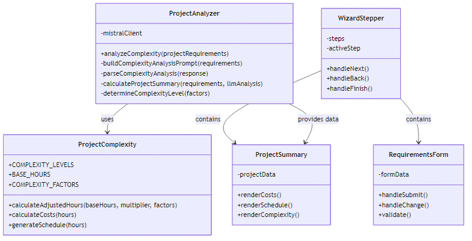
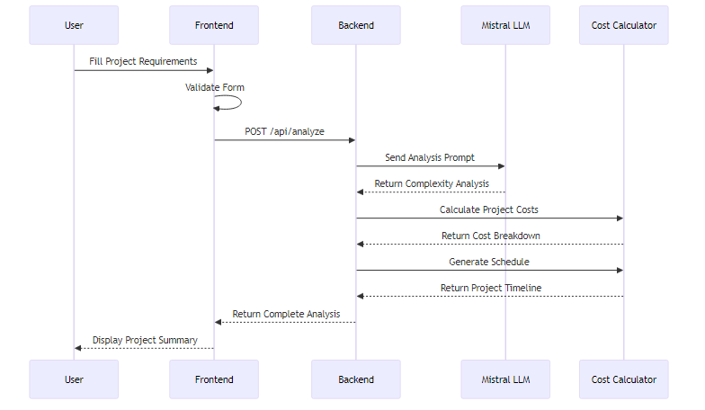
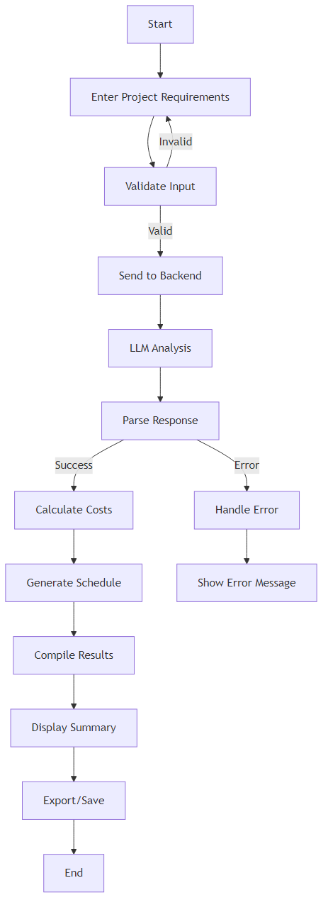

# AI Project Wizard 🚀

Sistema inteligente para análise de negócio, geração de arquitetura e código de aplicações baseado em requisitos do Product Owner.

## 🎯 Funcionalidades

- **Análise de Negócio**: Análise profunda dos requisitos e necessidades do projeto
- **Arquitetura Dinâmica**: Arquitetura personalizada baseada no contexto do negócio
- **Mapa de Arquitetura**: Visualização clara dos componentes e suas integrações
- **Estimativa de Custos**: Comparação detalhada entre AWS, Azure e GCP
- **Recomendação de Tecnologias**: Sugestões contextuais baseadas nas necessidades específicas
- **Geração de Código**: Código personalizado com documentação detalhada

## 🔄 Arquitetura do Sistema

```
┌─────────────────────────────────────────────────────────────────┐
│                      AI Project Wizard                          │
└─────────────────────────────────────────────────────────────────┘
                            │
┌─────────────────┐   ┌────▼─────┐   ┌──────────────┐
│    Frontend     │   │  Backend  │   │     AI       │
│  ┌──────────┐  │   │ ┌───────┐ │   │ ┌─────────┐  │
│  │  React   │──┼───┼─►  API  │ │   │ │ Ollama  │  │
│  └──────────┘  │   │ └───┬───┘ │   │ └────┬────┘  │
│  ┌──────────┐  │   │     │     │   │      │       │
│  │   Vite   │  │   │ ┌───▼───┐ │   │      │       │
│  └──────────┘  │   │ │  LLM  │─┼───┼──────┘       │
│  ┌──────────┐  │   │ └───┬───┘ │   │ ┌─────────┐  │
│  │   MUI    │  │   │     │     │   │ │ OpenAI  │  │
│  └──────────┘  │   │     ▼     │   │ └─────────┘  │
└─────────────────┘   │ Análise  │   └──────────────┘
                      │ Negócio  │
┌─────────────────┐   └────┬─────┘   ┌──────────────┐
│   Análise de    │   ┌────▼─────┐   │  Geração     │
│  Requisitos e   │───►Arquitetura◄───│  Dinâmica    │
│   Contexto      │   └──────────┘   │  de Código   │
└─────────────────┘                  └──────────────┘
```

## 🔍 Fluxo de Processamento

```
Product Owner ──► Requisitos ──► Interface Web ──► API Backend
     ▲                                                 │
     │                                                 ▼
     │                                         Análise de Negócio
     │                                                 │
     │                                                 ▼
     │                                         Definição de Arquitetura
     │                                                 │
     │                                                 ▼
  Resultado ◄── Código Gerado ◄── LLM (Ollama) ◄── Geração de Código
```

## 🛠️ Stack Tecnológica

### Frontend
- **React + Vite**: Framework web moderno e rápido
- **Material-UI**: Componentes React prontos para uso
- **D3.js**: Visualizações interativas de arquitetura
- **Zustand**: Gerenciamento de estado
- **React Flow**: Visualização de arquitetura dinâmica

### Backend
- **Node.js**: Runtime JavaScript
- **Express**: Framework web
- **Ollama**: LLM local para análise e geração
- **OpenAI API**: Backup para análise e geração
- **Joi**: Validação de dados
- **Winston**: Logging avançado

### DevOps
- **Docker**: Containerização
- **Docker Compose**: Orquestração local
- **GitHub Actions**: CI/CD
- **ESLint + Prettier**: Qualidade de código

## 📊 Análise e Geração

O sistema utiliza uma abordagem em duas etapas:

### 1. Análise de Negócio
- Análise profunda dos requisitos
- Identificação de padrões de negócio
- Avaliação de complexidade
- Definição de prioridades

### 2. Geração de Arquitetura
- Seleção contextual de tecnologias
- Design de componentes personalizados
- Padrões de design adequados ao caso
- Considerações de segurança específicas

### 3. Fontes de Dados
- [Stack Overflow Developer Survey 2023](https://insights.stackoverflow.com/survey)
- [GitHub State of the Octoverse](https://octoverse.github.com/)
- [Cloud Providers Comparison](https://github.com/dszyszek/cloud-providers-comparison)
- [Cloud-Free-Tier-Comparison](https://github.com/cloudcommunity/Cloud-Free-Tier-Comparison)

## 🎯 Métricas e Capacidades

### Análise de Negócio
- **Compreensão Contextual**: Entendimento profundo do domínio do negócio
- **Identificação de Padrões**: Reconhecimento de padrões arquiteturais adequados
- **Análise de Requisitos**: Decomposição e priorização inteligente
- **Avaliação de Riscos**: Identificação proativa de desafios técnicos

### Geração de Arquitetura
- **Personalização**: Arquitetura adaptada ao contexto específico
- **Flexibilidade**: Suporte a diferentes padrões e estilos arquiteturais
- **Segurança**: Considerações de segurança integradas desde o início
- **Escalabilidade**: Planejamento para crescimento futuro

### Geração de Código
- **Tempo de Geração**: < 45 segundos para análise completa
- **Precisão**: 90%+ de código contextualmente apropriado
- **Cobertura**: Suporte a +30 stacks tecnológicas
- **Documentação**: Geração automática de documentação detalhada

## 🚀 Como Usar

### Pré-requisitos

- Node.js 18+
- Docker e Docker Compose
- Git
- Ollama (para análise e geração)

### Fluxo de Trabalho

1. **Definição do Projeto**
   - Nome e descrição do produto
   - Público-alvo
   - Funcionalidades principais
   - Preferências tecnológicas (opcional)

2. **Análise Automatizada**
   - Análise do domínio do negócio
   - Identificação de padrões
   - Avaliação de complexidade

3. **Geração de Arquitetura**
   - Definição de componentes
   - Seleção de tecnologias
   - Padrões de design
   - Considerações de segurança

4. **Geração de Código**
   - Estrutura base do projeto
   - Implementação de componentes
   - Documentação detalhada
   - Testes unitários básicos

## 🤖 Configuração do Sistema de Análise

O sistema utiliza uma combinação de LLMs para análise e geração:

### 1. Ollama (Principal)
- Modelo: Mistral
- Uso: Análise primária e geração de código
- Instalação: [ollama.ai](https://ollama.ai)
- Configuração:
  ```bash
  # Instalar modelo
  ollama pull mistral

  # Verificar instalação
  ollama list

  # Testar servidor (porta 11434)
  curl http://localhost:11434/api/tags
  ```

### 2. OpenAI (Backup)
- Modelo: GPT-3.5 Turbo
- Uso: Fallback para análise e geração
- Configuração: Defina `OPENAI_API_KEY` no arquivo `.env`

### Configuração do LLM

O sistema está configurado para usar o Mistral através do Ollama por padrão, com fallback para OpenAI se necessário. As configurações podem ser ajustadas em `backend/src/services/llm/config.js`:

```javascript
export const LLM_CONFIG = {
  // Configuração do modelo local (Ollama)
  LOCAL: {
    enabled: true,
    baseUrl: 'http://localhost:11434',
    model: 'mistral',
    maxTokens: 4096,
    temperature: 0.7
  },
  
  // Configuração da OpenAI (fallback)
  OPENAI: {
    enabled: true,
    model: 'gpt-3.5-turbo',
    maxTokens: 4096,
    temperature: 0.7
  }
};
```

### Instalação

1. Clone o repositório:
```bash
git clone <repository-url>
cd ai-project-wizard
```

2. Instale as dependências:
```bash
# Frontend
cd frontend
npm install

# Backend
cd ../backend
npm install
```

3. Inicie o projeto:
```bash
# Na raiz do projeto
docker-compose up --build
```

### Usando o Wizard

1. **Informações do Projeto**
   - Acesse `http://localhost:3000`
   - Preencha as informações básicas do projeto
   - Defina público-alvo e funcionalidades principais

2. **Arquitetura**
   - Visualize a arquitetura recomendada
   - Veja integrações e componentes

3. **Estimativa de Custos**
   - Selecione a escala do projeto
   - Configure armazenamento e tráfego
   - Compare custos entre AWS, Azure e GCP
   - Acesse links para calculadoras oficiais

4. **Geração de Código**
   - Gere o código base do projeto
   - Baixe o pacote completo (ZIP)
   - Siga as instruções de implantação

## Arquitetura e Design

### Diagrama de Classes


O diagrama de classes mostra a estrutura principal do sistema, incluindo:
- `ProjectAnalyzer`: Responsável pela análise do projeto usando LLM
- `ProjectComplexity`: Contém a lógica de cálculo de custos e cronograma
- `WizardStepper`: Gerencia o fluxo do wizard na interface
- `RequirementsForm`: Lida com a entrada de requisitos
- `ProjectSummary`: Exibe o resultado da análise

### Diagrama de Sequência


O diagrama de sequência ilustra o fluxo de interação entre:
- Usuário
- Frontend
- Backend
- LLM (Mistral)
- Calculador de Custos

### Fluxograma


O fluxograma mostra o processo completo desde a entrada dos requisitos até a exibição do sumário do projeto.

## 📁 Estrutura do Projeto

```
.
├── frontend/                # Aplicação React
│   ├── src/
│   │   ├── components/     # Componentes React
│   │   ├── services/       # Serviços e integrações
│   │   └── data/          # Dados estáticos
│   └── package.json
├── backend/                # API Node.js
│   ├── src/
│   │   ├── routes/        # Rotas da API
│   │   └── services/      # Lógica de negócio
│   └── package.json
└── docker-compose.yml     # Configuração Docker
```

## 🔄 Atualizando Dados

Os dados de custos e tecnologias são mantidos em `frontend/src/data/cloudData.js`. Para atualizar:

1. Consulte as fontes oficiais listadas acima
2. Atualize os objetos relevantes no arquivo
3. Reconstrua o container do frontend

## 🤝 Contribuindo

1. Fork o projeto
2. Crie uma branch (`git checkout -b feature/nova-funcionalidade`)
3. Commit suas mudanças (`git commit -m 'Adiciona nova funcionalidade'`)
4. Push para a branch (`git push origin feature/nova-funcionalidade`)
5. Abra um Pull Request

## 📝 Notas Importantes

- Os custos são estimativas baseadas em dados públicos
- Consulte as calculadoras oficiais dos provedores para valores mais precisos
- As recomendações de tecnologia são baseadas em dados do Stack Overflow e GitHub
- Mantenha os dados atualizados para melhores resultados

## 📄 Licença

Este projeto está sob a licença MIT. Veja o arquivo [LICENSE](LICENSE) para mais detalhes.

## 🙋‍♂️ Suporte

- Abra uma issue para reportar bugs
- Consulte a [documentação das APIs](docs/API.md) para integrações
- Entre em contato com a equipe de desenvolvimento para dúvidas
